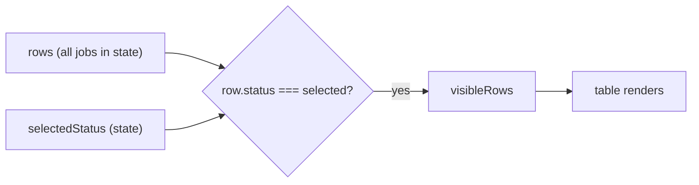

## What we're building

A simple dropdown above the table. When you pick a status (e.g. `interview 2`), the table only shows rows whose `status` matches. Picking `All` shows everything.

## Why client-side first

The browser already has the full `rows: Job[]` array in [JobTable.tsx](job-tracker-web/src/app/components/JobTable.tsx). Filtering in JavaScript is just `rows.filter(...)`. No new API route, no new database query. It's the right starting point for a small dataset and teaches the core React pattern: **state drives what you render**.

## How it works (mental model)



We never throw rows away. We derive a `visibleRows` array on each render from `rows` + `selectedStatus`. If the user clears the filter, the full list is back instantly.

## Changes

All changes are in [job-tracker-web/src/app/components/JobTable.tsx](job-tracker-web/src/app/components/JobTable.tsx):

1. Add a new state value:
   ```tsx
   const [statusFilter, setStatusFilter] = useState<JobStatus | "all">("all");
   ```

2. Derive the filtered list (just before `return`):
   ```tsx
   const visibleRows =
     statusFilter === "all"
       ? rows
       : rows.filter((r) => r.status === statusFilter);
   ```

3. Render a `<select>` above the table with options from the existing `STATUS_OPTIONS` array plus an `All` option, wired to `setStatusFilter`.

4. Replace `rows.length` and `rows.map` inside the `<tbody>` with `visibleRows.length` and `visibleRows.map`. Update the empty-state message to something like `No jobs match this filter.` when a filter is active.

That's it. ~15 lines of code, one file.

## Things to watch out for (small gotchas)

- Keep `rows` as the source of truth. Edits and deletes still call `setRows`, never `setVisibleRows`. `visibleRows` is just a view.
- The `STATUS_OPTIONS` constant in the file is missing `"interview"` and `"offer"` that exist in the [Job type](job-tracker-web/src/types/job.ts). Not blocking for this feature, but worth noting later.

## How to test

1. Run the app, go to the jobs page.
2. Confirm the dropdown appears above the table and defaults to `All`.
3. Pick `applied` -> only applied rows show. Pick `All` -> everything returns.
4. With a filter active, edit a row's status to something that no longer matches the filter -> it should disappear from the visible list (because `rows` updated and the derived list re-runs).
5. With a filter active, delete a row -> it should be removed cleanly.